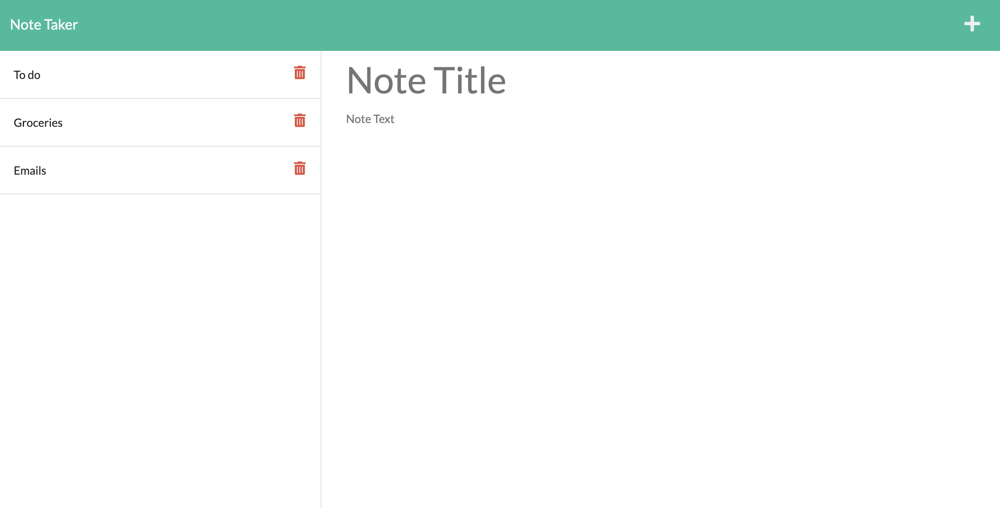

# Homework 11: Note Taker

## Objectives 
Build a note-taking app that allows a user to save and view notes on their computer. 

## Usage
User can click on "Get Started" from the main page and be brought to the note-taking app. There they can save a note by clicking the save button. The saved note will be added to the side in a list format. The user can click on a saved note to view it on the right side of the screen.

## Link to deployed page on GitHub
[Link to deployed page](https://github.com/erikaosterbur/note-taker.git)

## Link to deployed pag on Heroku
[Link to deployed page](https://erikaosterbur-note-taker.herokuapp.com/)

## Screen shot
